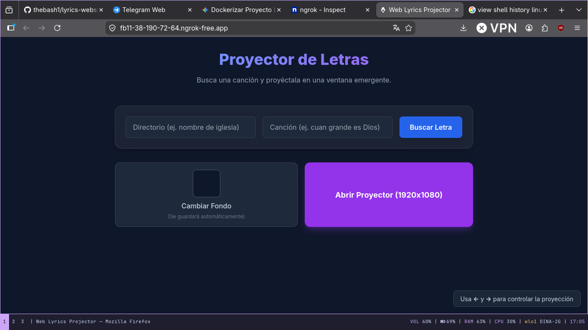

# Web Lyrics Projector

Un proyector de letras web dinámico y en tiempo real que te permite cargar letras de canciones y proyectarlas en una ventana separada, ideal para eventos, karaoke o presentaciones.  

## Tecnologías Utilizadas

* **Astro**: El framework web principal utilizado para construir la aplicación. Proporciona la estructura de rutas (como la vista de control `/` y la vista del proyector `/popup`) y la capacidad de levantar endpoints de API del lado del servidor (`/api/lyrics`).
* **Node.js**: Entorno de ejecución en el servidor (backend) integrado con Astro, encargado de la lectura y procesamiento de los archivos locales de letras.
* **Tailwind CSS**: Framework de CSS basado en utilidades, usado para estilizar rápidamente la interfaz de la aplicación, dándole un diseño oscuro, moderno y responsivo con animaciones suaves (fade in/out).
* **BroadcastChannel API**: Una tecnología y API nativa del navegador que permite la comunicación instantánea en tiempo real entre la ventana principal (el control) y la ventana emergente (el proyector) sin necesidad de WebSockets ni servidores en tiempo real de terceros.

## Librerías Implementadas

El proyecto utiliza un conjunto de herramientas eficientes en el entorno del servidor para servir las letras de las canciones en tiempo real:

* **Módulos Nativos de Node (`fs/promises`, `path`)**: Se utilizan para acceder al sistema de archivos local y cargar eficientemente los archivos `.txt` que contienen las letras de las canciones desde el directorio `public/ly/`.
* **[LRU-Cache](https://www.npmjs.com/package/lru-cache)**: Librería empleada para almacenar en caché temporalmente en memoria las letras de canciones que ya han sido cargadas. Esto evita lecturas repetidas al disco y agiliza los tiempos de respuesta.

## ¿Cómo funciona la búsqueda y la proyección?

El flujo de trabajo central de la aplicación se divide en dos fases: Carga de Letras y Proyección (Sincronización).

### 1. Carga y Procesamiento de Letras
El proceso de obtención de las letras ocurre de la siguiente manera:
1. **Entrada del usuario**: En la página principal, el usuario escribe el nombre del artista y la canción en el formulario de búsqueda.
2. **Petición a la API Interna**: El cliente web hace una solicitud HTTP al endpoint del servidor de Astro (`/api/lyrics/search?path=[artista]/[cancion]`).
3. **Lectura y Análisis**:
   - El servidor de Astro busca el archivo correspondiente en el directorio público (`public/ly/[artista]/[cancion].txt`).
   - Una vez que lee el contenido, normaliza los saltos de línea y separa el texto en bloques lógicos (estrofas/versos).
   - Asigna secciones automáticamente ("Intro", "Parte 1", etc.) y agrupa la letra final en un array (lista) de "versos" (o "slides").
4. **Respuesta**: La API devuelve esta estructura limpia y formateada en formato JSON hacia el navegador.

### 2. Sincronización y Proyección (BroadcastChannel)
Una vez que el navegador recibe la letra, comienza la magia de la sincronización en vivo:
1. **El Proyector**: El usuario pulsa en el botón "Abrir Proyector". Esto abre una nueva ventana emergente (el popup) y la configura en una resolución fija y grande (como 1920x1080) enfocada 100% en el texto.
2. **Canal de Comunicación (El Puente)**: Ambas ventanas (el controlador y el proyector) instancian y se suscriben automáticamente al mismo canal de radio interno del navegador (`new BroadcastChannel('lyrics_channel')`).
3. **Carga Inicial**: La ventana principal transmite los versos descargados y la imagen de fondo personalizada (si la hubiera) a través de este canal (enviando mensajes como `LYRICS_LOADED` y `SET_BACKGROUND`). El proyector capta estos mensajes y se configura para estar "listo".
4. **Control en Tiempo Real**: Cuando el usuario en la ventana principal presiona las flechas del teclado (`←` o `→`) o hace clic en un verso específico, el controlador actualiza el índice de la diapositiva actual. Cada vez que esto ocurre, dispara un mensaje `CHANGE_SLIDE` a través del canal.
5. **Pintado y Animación**: La ventana del proyector recibe el evento `CHANGE_SLIDE` casi instantáneamente, sin latencia de red. Al recibirlo, usa transiciones de CSS y actualización del DOM para difuminar (fade-out) el texto anterior y mostrar (fade-in) de manera elegante el nuevo verso en pantalla completa.
